
<h1>Mobile App Development for iOS </h1>
<h3>DePaul University (CSC-471)</h3>

01/02/2018

 
<h3>Notes</h3>

<h4>Apple Developer Program</h4>
<ul>
  <li>Students have access to the DePaul Apple license for free but the only stipulation is that you can't publish an app online.
  <li>Have to pay $100 for a normal license that allows you to publish</li>
</ul>

<h4>Tentative Topics for the Course</h4>
<ol>
  <li>Introduction to Xcode and iOS SDK</li>
  <li>Introduction to Swift programming language</li>
  <li>iOS Application Architecture</li>
  <li>Building simple UI and handling interactions</li>
  <li>Storyboard, scenes and segues</li>
  <li>Multi-view applications</li>
  <li>Tabbed Views</li>
  <li>Popups</li>
  <li>Table Views</li>
  <li>Adaptive and auto layout</li>
  <li>Tablets</li>
  <li>Multi-threads</li>
  <li>Touch Events and Gestures</li>
  <li>2d graphics</li>
  <li>Animations and Transitions</li>
</ol>

<h4>Why are we Here?</h4>
<ul>
  <li>To learn and build iOS Applications</li>
  <li>To Learn about Software Engineering and Object Oriented Architecture and Design</li>
</ul>

<h4>The Swift Language</h4>
<ul>
  <li>We will be using Swift 4</li>
  <ul>
    <li>If you know a modern programming language such as C++, C#, or Java</li>
    <li>You can learn another language quickly</li>
    </ul>
    <li>Many similarities with Java/C++</li>
    <ul>
      <li>Loops, conditions, functions, data structures</li>
      <li>Structure of programs</li>
    </ul>
    <li>Many modern programming concepts</li>
    <li>The swift language ebook is also a good reference</li>
</ul>

<h4>Why Swift?</h4>
<ul>
  <li>The main language iOS uses is Objective-C and Swift</li>
  <ul>
    <li>SDK, frameworks, libraries, samples</li>
  </ul>
  <li>Swift is modern</li>
  <ul>
    <li>An alternative to Objective-C, not backward compatible</li>
    <li>Fully interoperable with Objective-C</li>
    <li>Swift & Objective-C share the same run-time libraries</li>
  </ul>
  <li>Interesting comparison with designs of C++ and Java</li>
  <li>Popularity is rising for swift</li>
</ul>

<h4>Does iOS Support Java?</h4>
<ul>
  <li>No: iOS does not support JavaScript of any kind</li>
  <li>JavaScript?</li>
  <ul>
    <li>Frameworks based on HTML + JavaScript, e.g. ApacheCordova, Sencha Touch</li>
    <li>Limited to the web view</li>
    <li>Limited access to the native API</li>
  </ul>
  <li>Java is the main Language for Android Development</li>
  <li>C# is the main language for Windows Mobile</li>
</ul>

<h4>What's Next</h4>
<ul>
  <li>Let's learn a little history about mobile computing and iOS</li>
    <li>Let's learn a little history about mobile computing and iOS</li>
    <li>Let's build our first iOS app</li>
    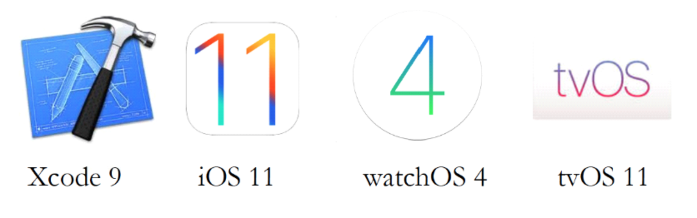
</ul>

<h4>Outline</h4>
<ul>
  <li>What is mobile computing?</li>
  <li>The convergence (mobile + computing)</li>
  <li>The story of Apple Inc</li>
  <li>The story of IOS</li>
</ul>

<h4>What is Mobile Computing?</h4>
<ul>
  <li>Computing technologies centered around mobile devices</li>
  <li>A (computing device that is) ... an iPod, a Phone an Internet communicator, ... - Steve Jobs, 2007</li>
  <li>I stands for Integrator?</li>
  <li>Mobile Computing = Computation + Mobility + Connectivity</li>
</ul>

<h4>Elements of Mobile computing</h4>
  <ul>
    <li>Mobile hardware, devices</li>
    <ul>
      <li>CPU, GPU, memory, network Connectivity</li>
    </ul>
    <li>Mobile Software</li>
    <ul>
      <li>Mobile platforms, and apps</li>
    </ul>
    <li>Mobile Connectivity</li>
    <ul>
      <li>Wireless Internet, WIFI, Bluetooth, cellular network</li>
    </ul>
    <li>Human Computer Interaction</li>
    <ul>
      <li>Alternative input mechanisms: touch, motion, voice</li>
      <li>User interface designs</li>
    </ul>
  </ul>

 
<h3>A Brief History of Apple and iOS</h3>
<h4>The story of Apple</h4>
  <ul>
    <li><h5>Apple I, 1976</h5></li>
    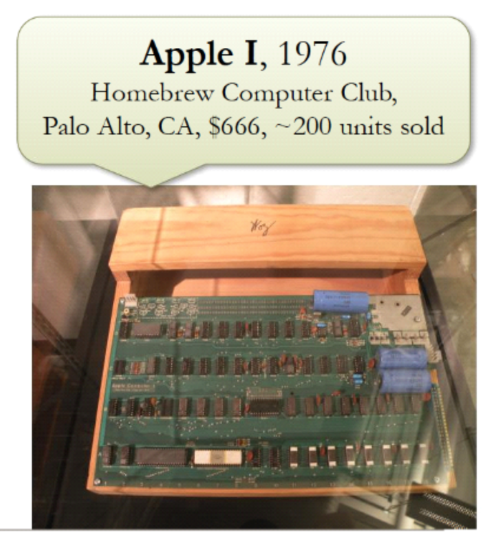
    <ul>
      <li>Apple Computer Inc. Incorporated on April 1, 1976 in Los Altos, CA</li>
      <li>Founders Steve Jobs and Steve Wozniak</li>
      <li>Apple I was the first product, 200 units sold at $666</li>
    </ul>
    <li><h5>Apple II, 1977</h5></li>
    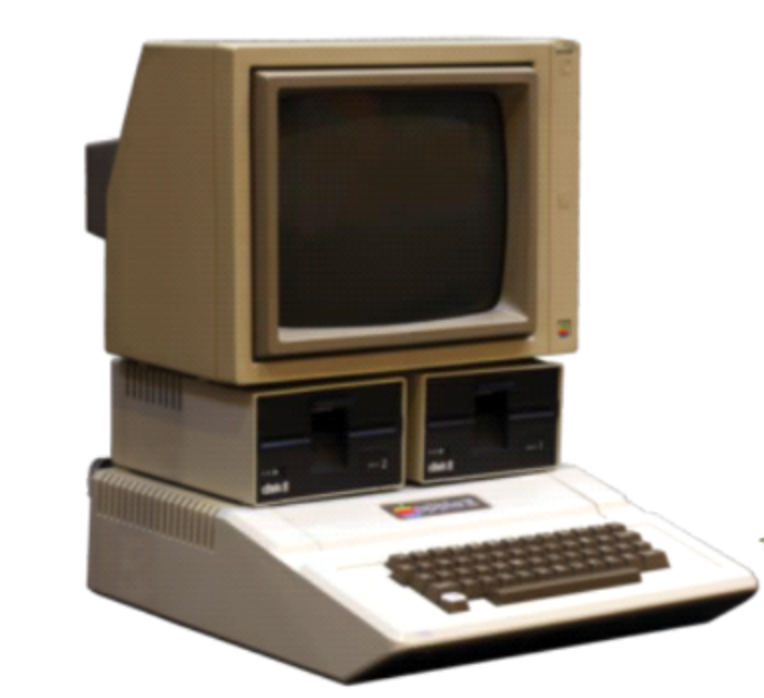
      <ul>
        <li>Introduced June 10, 1977</li>
        <li>First highly successful and mass produced PC
        <li>Retail $1298, sold 6 million units</li>
      </ul>
    <li><h5>Graphical User Interface (GUI) 1973-1981, Xerox PARC</h5></li>
      <ul>
        <li>The invention of GUI</li>
        <ul>
          <li>Windows, icons, menus, etc.</li>
          <li>The xerox Star workstation</li>
        </ul>
        <li>The invention of the mouse</li>
      </ul>
        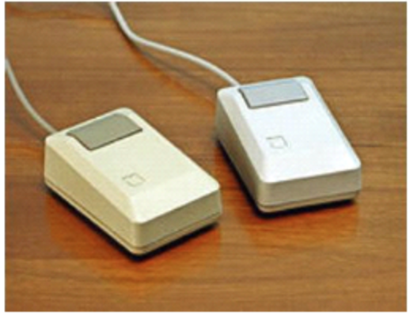
      <li><h5>The Macintosh Apple Computer, 1984</h5></li>
        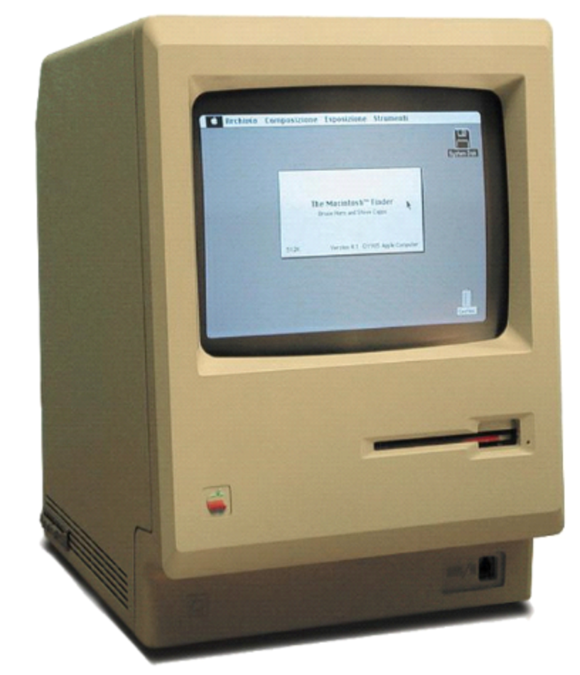
      <ul>
        <li>Steve Jobs visited Xerox PARC in the winter of 1979</li>
        <li>"What is going on here? You're sitting on a gold mine! Why aren't you doing something with this technology? You could change the world!"</li>
        <li>The first PC with a GUI and a mouse</li>
      </ul>
      <li><h5>Motorola DynaTax 1983, Motorola Corp.</h5></li>
      <ul>
        <li>Inventor, Martin Cooper</li>
        <li>The first cell phone approved for commercial use</li>
        <li>Weight: 2lbs</li>
      </ul>
      <li><h5>The Oust of Jobs, 1985</h5></li>
      <ul>
        <li>Steve Jobs was forced out of Apple by CEO John Sculley, May 1985</li>
        <li>Sold all but one of his 6.5 million shares</li>
        <li>Acquired Pixar for $5 Million</li>
        <li>Started NeXt Incorporated, introduced the NeXT computer in 1988</li>
        <ul>
          <li>Retail $6500 and 50,000 units were sold</li>
          <li>Operating System: NeXTSTEP
          <li>Tim Berners-Lee used a NeXT Computer in 1990 to create the first web browser and web server</li>
        </ul>  
      </ul>
        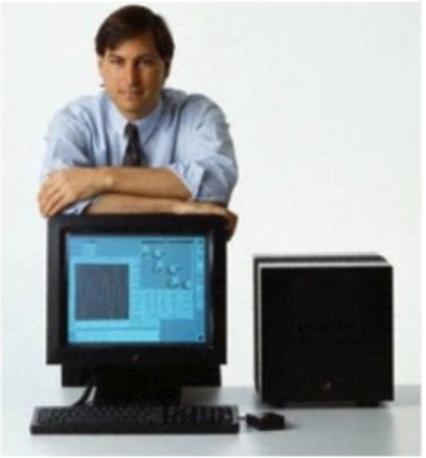
      <li><h5>Newton Message Pad Apple Computer, 1993</h5></li>
        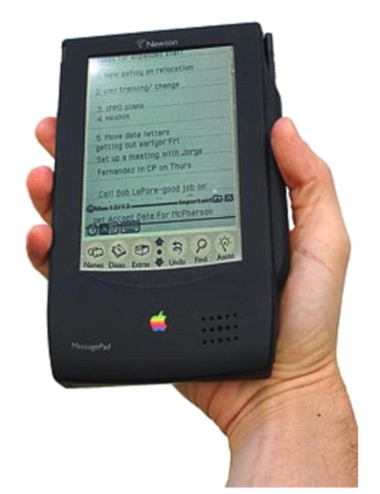
      <ul>
        <li>The first commercially available hand-held Computer</li>
        <li>Pioneer of Personal Digital Assistant (PAD)</li>
        <li>Weight: 1.4 lbs</li>
        <li>ARM 610 CPU, 32-Webkit</li>
        <li>4 MB ROM, 540 KB RAM</li>
        <li>336 x 240 BW Display</li>
        <li>Handwriting Recognition</li>
      </ul>
      <li><h5>Palm Pilot 1000, US Robotics 1996</h5></li>
      <ul>
        <li>The first commercially successful personal digital Assistant (PDA)</li>
        <li>Stylus input</li>
        <li>Graffiti handwriting Recognition</li>
        <li>Infrared Port</li>
      </ul>
      <li><h5>BlackBerry Quark 2003, Research in motion</h5></li>
      <ul>
        <li>The first device with integrated cell phone and email</li>
        <li>QWERTY Keyboard</li>
        <li>SMS</li>
      </ul>
      <li><h5>The Rise of Windows</h5></li>
      <ul>
        <li>Micrsoft Launched Windows 3.0 on May 22, 1990</li>
        <ul>
          <li>The first Microsoft GUI Operating System</li>
          <li>2 Million copies sold in the first 3 months</li>
        </ul>
        <li>Windows 3.1 released on March 1, 1992</li>
        <ul>
          <li>Dominated the market 85.7%</li>
        </ul>
        <li>Apple sued Microsoft for copyright infringement</li>
        <li>Windows 95 released on August 24, 1995</li>
        <ul>
          <li>Windows, all versions, 88.6% (Mac OS 4.6%)</li>
        </ul>
        <li>DOJ opened investigation of Microsoft for abusing its Monopoly position of Windows</li>
      </ul>
      <li><h5>The Return of Jobs, 1977</h5></li>
      <ul>
        <li>Apple acquired NeXT for $429 Million, December 20, 1996</li>
        <ul>
          <li>Use NeXTSTEP as a foundation to replace  Mac OS</li>
        </ul>
        <li>Steve Jobs back to Apple as a Consultant</li>
        <li>Apple board ousted CEO Gil Amelio, July 1997</li>
        <ul>
          <li>Steve Jobs names interim CEO, later CEO</li>
          <li>Until his resignation on August 24, 2011</li>
        </ul>
        <li>Microsoft invested $150 Million in Apple</li>
      </ul>
      <li><h5>The Comeback</h5></li>
        <ul>
          <li>iMac, August 15, 1998</li>
          <li>iPod & iTunes, October 2001</li>
          <li>Mac OS X, March 2001</li>
        </ul>
      <li><h5>iPhone June 2007, Apple Computer</h5></li>
        <ul>
          <li>The first integrated smart Phone</li>
          <li>Multi-touch Interface</li>
          <li>Virtual Keyboard</li>
          <li>Wifi & 3G</li>
        </ul>
      <li><h5>iPhone Tablet Computer April 2010, Apple Computer</h5></li>
        <ul>
          <li>the first commercially successful tablet Computer</li>
        </ul>
  </ul>

<h4>The Most Influential Tech Products Over the Past Two Decades</h4>
<ol>
  <b><li>Netwon MessagePad (1993)</li></b>
  <li>Netscape Navigator (1994)</li>
  <li>Windows 95 (1995)</li>
  <li>The Palm Pilot (1997)</li>
  <li>Google Search (1998)</li>
  <b><li>The iPod (2001)</li></b>
  <li>Facebook (2004)</li>
  <li>Twitter (2006)</li>
  <b><li>The iPhone (2007)</li></b>
  <li>Android (2008)</li>
  <b><li>The MacBook Air (2008)</li></b>
  <b><li>The iPad (2010)</li></b>
</ol>

<h4>Apple Joins Dow Jones Industrial Average 30 stocks</h4>
<ul>
  <li>March 19, 2015 Apple replace AT&T in DIJA</li>
  <li>Apple traded on NASDAQ</li>
  <ul>
    <li>Went public Dec 12, 2980 at $22 per share</li>
    <li>2-for-1 split in 1987, 2000, 2005, 2015</li>
    <li>Closing price on Dec 1, 2017 $171.05 per share</li>
  </ul>
  <li>Apple is now the world's most valuable company</li>
  <ul>
    <li>Market capitalization about $878.22 Billion</li>
  </ul>
</ul>

<h4>Hello, iOS 11</h4>
  <ul>
    <li>Released in September 2017</li>
      <ul>
        <li>Installed on 54% of iOS devices, as of November 2017</li>
      </ul>
    <li>Highlights of iOS 10</li>
    <ul>
      <li>Haptic feedback</li>
      <li>Wide color</li>
      <li>Siri Webkit</li>
      <li>Speech Recognition</li>
      <li>Improvements of SDK</li>
      <li>Swift 3</li>
    </ul>
    <li>Highlights of iOS 11</li>
    <ul>
      <li>Redesigned UI: Dock Keyboard, control center, multitasking</li>
      <li>iCloud Drive, Files App</li>
      <li>Drag and Drop</li>
      <li>Camera and live photos</li>
      <li>Swift 4</li>
    </ul>
  </ul>

  <h4>Mural - Banksy, 2015 Inside Migrant Camp, Calais, France</h4>
    

  <h4>Highway 61 Revisited, 1965 - Bob Dylan, Nobel Laureate, 2016</h4>
  <ul>
    <li>Steve Jobs illegally downloaded Bob Dylan back in the day</li>
    <li>He wanted to correct his wrong doing and make sure that musicians got what they deserve</li>
  </ul>

  <h4>FBI vs Apple, 2016</h4>
  <ul>
    <li>San Bernidino shooting</li>
    <li>iPhone 5 all contents were encrypted</li>
    <li>Privacy of iPhone users have to be protected</li>
  </ul>

  <h4>Steve Jobs 1955-2011</h4>

  

  <h2>Build Your First iOS App</h2>

  <h4>Outline</h4>
  <ul>
    <li>Xcode IDE basics</li>
    <li>Creating a new Project</li>
    <li>An Anatomy of an iOS project</li>
    <li>Widgets and attributes</li>
    <li>App icons and images</li>
    <li>Running apps in iOS simulators</li>
  </ul>

  <h4>Xcode IDE and iOS SDK</h4>
  <ul>
    <li>We Will be using</li>
    <ul>
      <li>SDK for iOS 11</li>
      <li>Xcode 9 and Swift 4</li>
      <li>Mandatory for all programming assignments and the final Project</li>
    </ul>
    <li>Download and install the latest SDK and IDE from the App store</li>
    <li>PLEASE, PLEASE</li>
    <ul>
      <li>Once you get everything working</li>
      <li>Do NOT upgrade or change versions</li>
    </ul>
  </ul>

<h4>What's New in Xcode 9</h4>
<ul>
  <li>Support iOS 11 and Watch OS 4</li>
  <li>Improvements</li>
  <ul>
    <li>Swift Programming Language, Version 4</li>
    <li>Playground</li>
    <li>Adaptive Layout</li>
  </ul>
  <li>Stack View</li>
  <li>Storyboard references</li>
  <li>UI Testing</li>
</ul>

<h4>What's unique about Mobile Apps</h4>
<ul>
  <li>One active application at a time (until iOS 9, Multi-tasking and split screen in iOS 9)</li>
  <li>One window on screen, not shared (only due to larger screens. Most restrictions still apply)</li>
  <li>Quick response time</li>
  <li>Limited screen size</li>
  <li>Limited system resources</li>
  <ul>
    <li>Memory, battery power (processing)</li>
  </ul>
  <li>No Garbage collector (as Java has)</li>
  <ul>
    <li>You have more responsibilities</li>
  </ul>
</ul>

<h4>Launch Xcode 9</h4>
<ul>
  <li>Choose a Project template</li>
  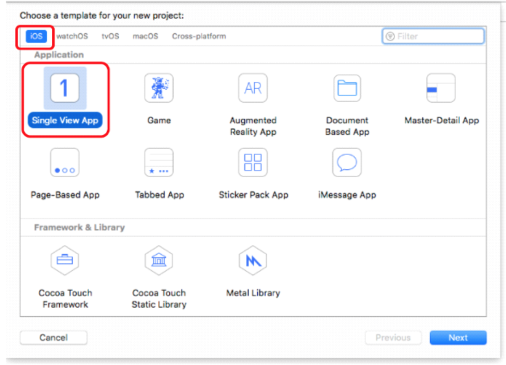
  <ul>
    <li>iOS</li>
    <li>Application</li>
    <li>Single View Application: Creates an app with a single view. App template ready to run</li>
  </ul>
  <li>Click Next</li>
</ul>

<h4>Project Options</h4>
  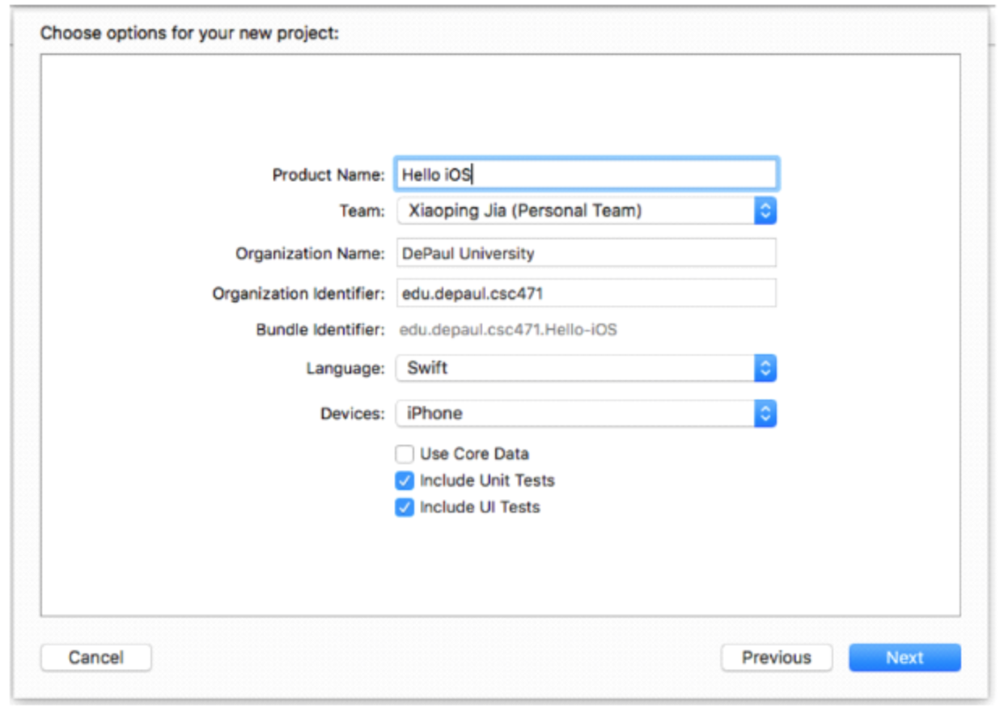
<ul>
  <li>When creating a project choose:</li>
  <ul>
    <li>Project Name</li>
    <li>Team</li>
    <li>Org Name</li>
    <li>Org Id</li>
    <li>Language: Swift</li>
    <li>Devices: iPhone</li>
    <li>Include Unit Tests</li>
    <li>Include UI Tests</li>
  </ul>
  <li>Click Next</li>
  <li>Choose a Project location</li>
    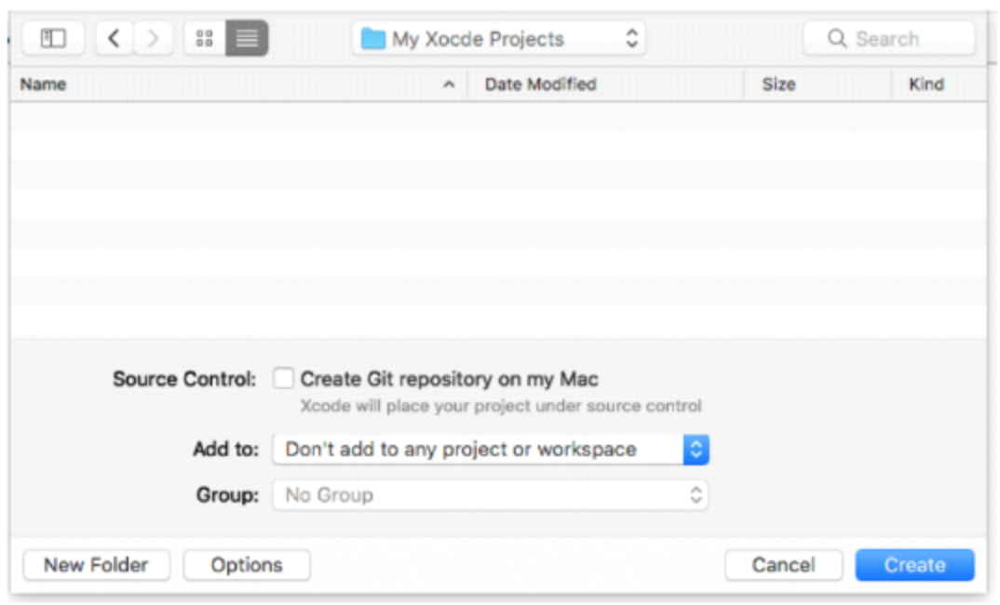
  <ul>
    <li>Choose a folder on your machine</li>
    <li>Source control is optional</li>
    <li>Click create</li>
  </ul>
</ul>

<h4>The initial project View</h4>
  
<h4>Demo</h4>

<h4>Xcode Workstation</h4>
<ul>
  <li>The Navigation area</li>
  <ul>
    <li>Shows the overview of all of the pieces of the project</li>
  </ul>
  <li>The Toolbar</li>
  <ul>
    <li>The top bar with the build and side editors</li>
  </ul>
  <li>The Editor area</li>
  <ul>
    <li>Shows you the different parts of the Project</li>
    <li>Storyboard</li>
    <li>Source Code</li>
  </ul>
  <li>The Utility area</li>
  <ul>
    <li>Object Manager</li>
  </ul>
</ul>

<h4>Editors in Xcode</h4>
<ul>
  <li>Project editor</li>
  <ul>
    <li>Edit project-level properties and configurations</li>
    <li>Build options, target architectures, and app entitlements, etc. </li>
  </ul>
  <li>Interface Builder</li>
  <ul>
    <li>Graphically create and edit user interface files
    <li>Storyboards</li>
  </ul>
  <li>Source Editor</li>
  <ul>
    <li>Edit text files</li>
    <li>Swift Source code, etc.</li>
  </ul>
</ul>

<h4>The Project Navigator and Editor</h4>
  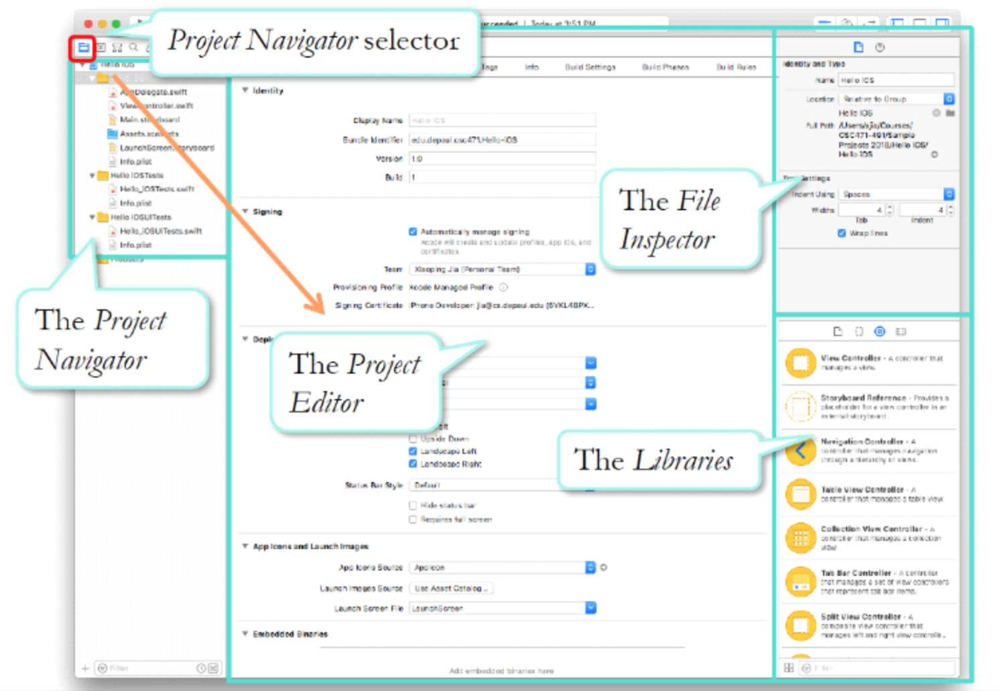
<ul>
  <li>The Project Navigator</li>
  <ul>
    <li>This shows the folder structure and where everything in the project is located</li>
  </ul>
  <li>The Project Editors</li>
  <ul>  
    <li>For the configuration or the things that you can change</li>
  </ul>
  <li>The file Inspector</li>
  <ul>
    <li>Right side of the screen</li>
    <li>Shows the types of Files</li>
  </ul>
</ul>

<h4>The Anatomy of an iOS Project</h4>
<ul>
  <li>Project Navigator View</li>
  <ul>
    <li>The project root (holds all the project files)</li>
    <ul>
      <li>App Delegate and view controller Files</li>
      <li>The assets catalog (images, icons, etc.)</li>
      <li>The storyboads (UI)</li>
      <li>The configuration file</li>
    </ul>
    <li>The Main Source Folder (APP_NAME iOS)
    <li>The test folders (The iOS Tests and iOSUnitTests)</li>
  </ul>
</ul>

<h4>File Types in an Xcode project</h4>
<ul>
  <li>.Storyboard</li>
  <ul>
    <li>UI views and Widgets</li>
    <ul>
      <li>Multiple-views</li>
      <li>Application-wide screen flows</li>
    </ul>
  </ul>
  <li>.xcassets</li>
  <ul>
    <li>Asset Catalogs</li>
    <li>Resources</li>
    <ul>
      <li>images, icons, and data etc.</li>
    </ul>
  </ul>
  <li>.plist</li>
  <ul>
    <li>Property list Files</li>
    <ul>
      <li>Configurations</li>
      <li>Application Data</li>
    </ul>
  </ul>
</ul>

<h4>iOS Project File Structure</h4>
  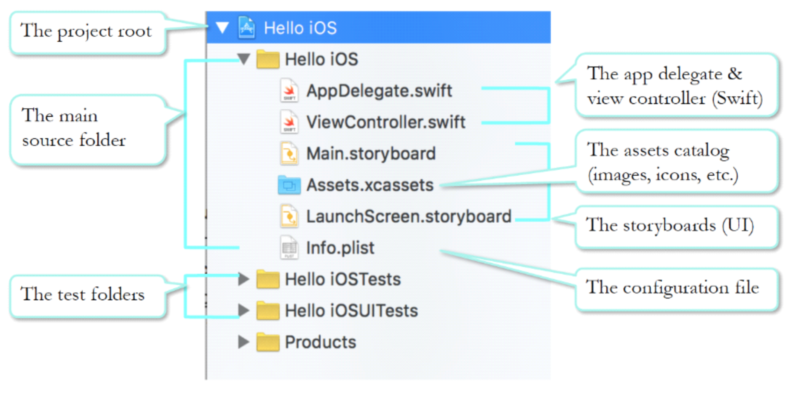
<ul>
  <li>The Project root</li>
  <li>The Main Source folder</li>
  <li>The test folders</li>
</ul>

<h4>The Interface: Builder: Building storyboards</h4>
<h4>The Xcode IDE: The Main Storyboards</h4>
  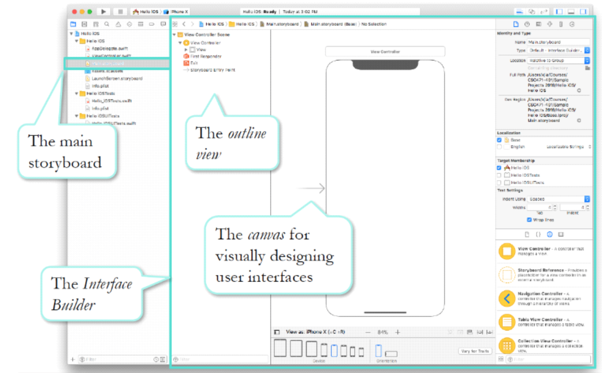
<ul>
  <li>the main storyboard from Xcode</li>
  <li>The outline View</li>
  <li>The canvas for visually designing user interfaces</li>
  <li>The storyboard entry point</li>
  <ul>
    <li>Arrow on the side of the entry screen</li>
    <li>Every app needs to have an entry point</li>
  </ul>
  <li>A scene representing the first screen of your app (the Screen)</li>
  <li>The dimension of the scene represent that of iPhone X</li>
  <li>The Object library: A scrollable list of UI widgets that can be inserted into a scene</li>
</ul>

<h4>Edit the First Scene</h4>
<ul>
  <li>Use the guidelines to position the widget</li>
  <li>Drag a widget to the scene from the object library</li>
</ul>

<h4>Edit the First Scene</h4>

<h4>Demo - Hello, iOS!</h4>

<h4>The screen size selector</h4>
<ul>
  <li>Located at the bottom of the canvas</li>
  <li>Indicate the screen size selected in the preview of the design</li>
  <li>Click to select a different size</li>
  <li>Other phones don't have the same dimensions</li>
  <li>The fixed position (WISIWG) approach does not accommodate different screen sizes</li>
</ul>

<h4>Adaptive Layout</h4>
<ul>
  <li>Xcode supports and encourage the us of Auto Layout</li>
  <ul>
    <li>A constrain based automatic mechanism that layouts the screens based on the actual screen sizes of the devices</li>
    <li>
    <li>To be able to automatically adapt to different screen sizes and both orientations</li>
  </ul
  <li>Xcode discourages the use of absolute positions and sizes (WISWYG approach)</li>
  <ul>
    <li>But, we will start with simpler approach at the beginning</li>
    <li>Use the auto layout will be covered soon</li>
  </ul>
</ul>

<h4>The Attribute Inspector</h4>
    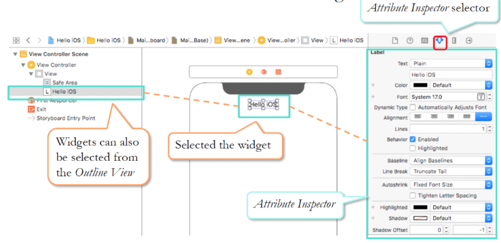
<ul>
  <li>Edit the attributes of the selected widgets</li>
  <li>Attribute Inspector selector</li>
  <li>Widgets can also be selected from the Outline View</li>
</ul>

<h4>Edit Widget attributes</h4>
<ul>
  <li>Change the font style, size, and color of the label</li>
  <ul>
    <li>Changes in Attributes may affect the layout</li>
  </ul>
  <li>Adjust layout</li>
  <li>Run</li>
</ul>

<h4>Demo</h4>

<h4>App Icons - In Different Contexts</h4>
<ul>
  <li>Every app has an app icon</li>
  <li>The app icon appears in several contexts and in different sizes, in points (pt)</li>
  <ul>
    <li>The Home Screen (60 x 60)</li>
    <li>Results of Spotlight search (40 x 40)</li>
    <li>The Settings app (29 x 29)</li>
  </ul>
  <li>Point, a logical unit that maintains a constant physical dimension on devices with different screen densities</li>
</ul>

<h4>iPhone Screen Resolutions</h4>
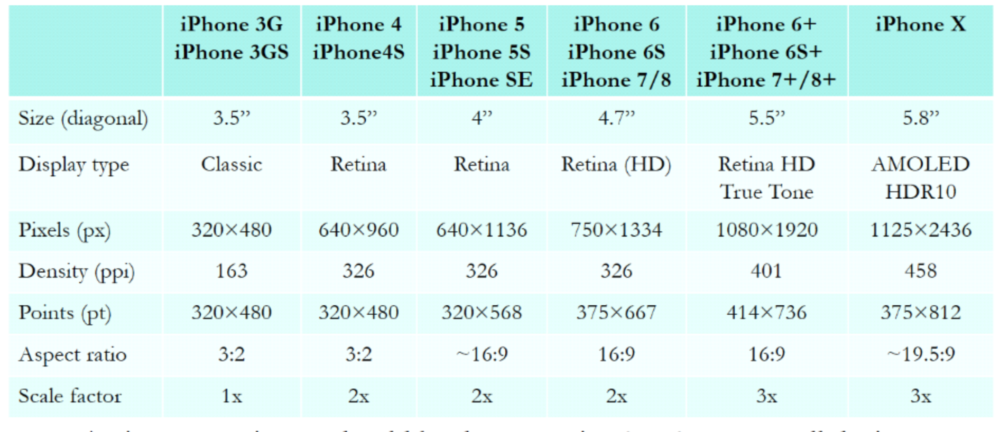
<ul>
  <li>Scale Factor</li>
  <li>An icon or an image should be the same size in points across all devices</li>
  <ul>
    <li>Different sizes in pixels</li>
  </ul>
  <li>For best results, provide icons/images in different pixel sizes</li>
</ul>

<h4>Managing Images with Xcode Asset Catalogs</h4>
<ul>
  <li>Xcode uses asset catalogs to simplify the management of icons and images </li>
  <li>Each asset catalog consists of </li>
  <ul>
    <li>A name, used to refer to the asset in your app </li>
    <li>A set of images of different sizes (in pixel)</li>
  </ul>
  <li>At runtime, iOS will load the image from the set that is most appropriate for the current scale factor</li>
  <ul>
    <li>An image will be scaled if necessary </li>
    <li>Runtime cost and reduced quality</li>
  </ul>
</ul>

<h4>Add App Icons</h4>
<ul>
  <li>In the Project Navigator</li>
  <ul>
    <li>Select images.xcassets</li>
    <li>select AppIcon</li>
    <li>Drag and drop images from finder folder</li>
  </ul>
</ul>

<h4>Add App Icons</h4>
<ul>
  <li>You should provide images of sizes</li>
  <li>Use PNG format</li>
  <ul>
    <li>Portable Network Graphics format</li>
  </ul>
  <li>Also Supports vector PDF format</li>
</ul>

<h4>Add App Icons</h4>
<ul>
  <li>Drag and drop image files into the image walls</li>
</ul>
